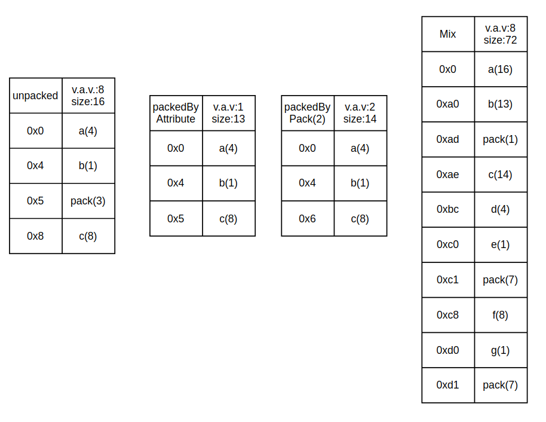

# 结构体对齐（64位Linux）

有关结构体对齐最关键的是要理清三个数值：

* 自身对齐值:变量的类型原有的默认对齐值，比如int是4,double是8,char是1
* 指定对齐值：通过#pragma pack或者attribute语法来显式地i指定对齐值
* 有效对齐值：Min（指定对齐值，自身对齐值）

结构体或类的自身对齐值为**其最大成员自身对齐值**

下面上代码分析：

```
#include <unistd.h>
#include <iostream>

using namespace std;

class unpacked
{
public:
    int a;
    char b;
    double c;
};

class PackedByAttrribute
{
public:
    int a;
    char b;
    double c;
} __attribute__((packed));

#pragma pack(2)
class PackedByPragma
{
public:
    int a;
    char b;
    double c;
};
#pragma pack()

class Mix
{
public:
    unpacked a;
    PackedByAttrribute b;
    PackedByPragma c;
    int d;
    char e;
    double f;
    char g;
};
//or:

int main(int argc, char **argv)
{
    unpacked A;
    PackedByAttrribute B;
    PackedByPragma C;
    Mix D;
    printf("unpacked: %d a:%p,b:%p,c:%p\n", sizeof(A), &A.a, &A.b, &A.c);
    printf("packed by attribute: %d a:%p,b:%p,c:%p\n", sizeof(B), &B.a, &B.b, &B.c);
    printf("packed by pragma pack: %d a:%p,b:%p,c:%p\n", sizeof(C), &C.a, &C.b, &C.c);
    printf("Mix: %d a:%p,b:%p,c:%p,d:%p,e:%p,f:%p,g:%p\n", sizeof(D), &D.a, &D.b, &D.c, &D.d, &D.e, &D.f, &D.g);
    return 0;
}

```

输出：

```
unpacked: 16 a:0x7fff41d5c9b0,b:0x7fff41d5c9b4,c:0x7fff41d5c9b8
packed by attribute: 13 a:0x7fff41d5c995,b:0x7fff41d5c999,c:0x7fff41d5c99a
packed by pragma pack: 14 a:0x7fff41d5c9a2,b:0x7fff41d5c9a6,c:0x7fff41d5c9a8
Mix: 72 a:0x7fff41d5c9c0,b:0x7fff41d5c9d0,c:0x7fff41d5c9de,d:0x7fff41d5c9ec,e:0x7fff41d5c9f0,f:0x7fff41d5c9f8,g:0x7fff41d5ca00
```

## 分析



### unpacked

gcc在64位下默认8字节对齐，最后一个double需要8地址对齐，所以需要空多3字节。这个类的有效对齐值为8,因为其成员的最大对齐值是8。

### packedByAttribute

这是gcc的编译器特有的语法，这样指定相当于1字节对齐，也就是pack（1），也有aligned（n）的语法。网络编程中时不时遇到，这样做可以节省一点网络流量，忽略双方机器的系统对齐情况。其大小就是各成员大小相加。

### packedByPack(2)

指定2字节对齐，所以最后一个double变量仅需要空一个字节便可实现2字节对齐，其有效对齐值为2。

### Mix

仅需要注意最后的char变量因为整个类的有效对齐值为8,所以整个类的大小为其对齐值的整数倍，所以还要补充7个字节对齐，各个成员在Mix中都根据自己的有效对齐值来对齐。

