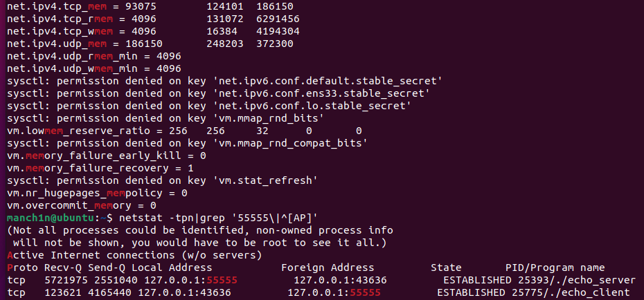
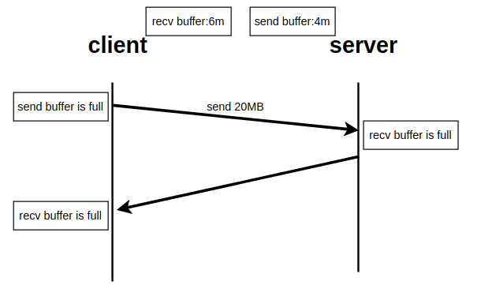

### 阻塞IO的阻塞实验

阻塞实验参考陈硕先生的视频。

这里的阻塞并不是调用read之后没有写的阻塞，然而实际上也是，但这是发生在网络中的，形成了一个互锁。

我们假设有一个阻塞实现的echo服务器和客户端，应用层面的发送和接受缓存都是4KB。服务器的代码逻辑是每收到4KB就回送，客户端的代码逻辑是完整的发送消息然后再完整地接受。

服务器端代码：

```c++
#include "../common_include.hpp"

#include <thread>
using namespace std;

int main(int argc, char **argv)
{
    int fd = socket(AF_INET, SOCK_STREAM, 0); //TCP
    assert(fd > 0);
    sockaddr_in servaddr;
    ::bzero(&servaddr, sizeof(servaddr));
    servaddr.sin_family = AF_INET;
    servaddr.sin_port = htons(55555);
    inet_aton("127.0.0.1", &servaddr.sin_addr);
    int err = bind(fd, SOCK_CAST(&servaddr), sizeof(servaddr));
    assert(err == 0);
    err = listen(fd, 5);
    assert(err == 0);

    while (1)
    {
        sockaddr_in client_addr;
        socklen_t client_addr_len;
        int connfd = accept(fd, SOCK_CAST(&client_addr), &client_addr_len);
        std::thread worker([&]()
                           {
                               int myfd = connfd;
                               while (1)
                               {
                                   char buf[4096];
                                   int nread = read(myfd, buf, 4096);
                                   cout << "read " << nread << " bytes" << endl;
                                   if (nread <= 0)
                                   {
                                       break;
                                   }
                                   int nsend = write(myfd, buf, nread);
                                   cout << "send " << nsend << " bytes" << endl;
                                   if (nsend <= 0)
                                   {
                                       break;
                                   }
                               }
                               close(myfd);
                           });
        worker.detach();
    }
    return 0;
}
```

客户端代码：

```c++
#include "../common_include.hpp"

int main(int argc, char **argv)
{
    ExitAssert(argc == 3, "usage: ./echo_client port msg_len");
    int fd = socket(AF_INET, SOCK_STREAM, 0); //TCP
    assert(fd > 0);
    sockaddr_in servaddr;
    ::bzero(&servaddr, sizeof(servaddr));
    servaddr.sin_family = AF_INET;
    servaddr.sin_port = htons(std::atoi(argv[1]));
    inet_aton("127.0.0.1", &servaddr.sin_addr);

    int err = connect(fd, SOCK_CAST(&servaddr), sizeof(servaddr));
    ExitAssert(err == 0, "connect");

    const size_t msgLen = std::atoi(argv[2]);
    size_t left = msgLen;
    char buf[4096];
    while (left)
    {
        int nwrite = 0;
        if (left > 4096)
        {
            nwrite = write(fd, buf, 4096);
        }
        else
        {
            nwrite = write(fd, buf, left);
        }
        ExitAssert(nwrite >= 0, "write");
        left -= nwrite;
    }
    left = msgLen;
    while (left)
    {
        int nread = 0;
        if (left > 4096)
        {
            nread = read(fd, buf, 4096);
        }
        else
        {
            nread = read(fd, buf, left);
        }

        if (nread <= 0)
        {
            break;
        }
        left -= nread;
    }
    std::cout << "read " << msgLen << " bytes" << std::endl;
    close(fd);
    return 0;
}
```

运行客户端：./client 55555 20240000

运行服务端：./server

发现阻塞现象。

#### 分析

通过

```shell
sysctl -A |grep mem
netstat -anp|grep 55555
```



知道tcp的发送缓冲最大约为4MB，接收缓冲为6MB，在阻塞实验中，可以看到服务端的接收缓冲已满，客户端的发送缓冲已满。这个过程是客户端以4KB为单位不停地发送，服务端在开始每接收4KB就回送4KB，但是客户端在发送完20MB前并不会调用read接收，这就导致了过一段时间后客户端的接收缓冲会满，从而进而阻塞服务端的send，进而逐渐阻塞服务端的read与客户端的write。



