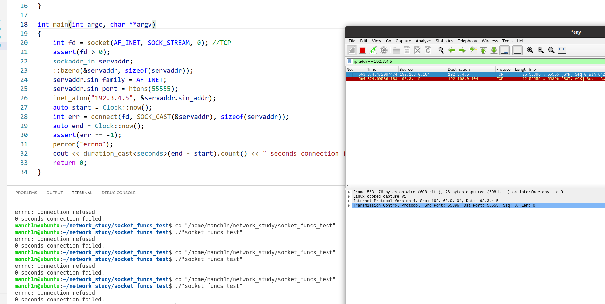

# Socket一些需要理解的函数

###  connect

调用connect会发送SYN报文，直到**第二次握手**完成后才会返回。根据UNP其失败主要有三种情形：

* 服务端没有对connect所发出的SYN有任何的返回，等待一段固定时间后就会引发ETIMEOUT，这个固定时间由系统指定。


* 服务端地址返回RST报文，这是由于对应服务端没有开启该端口引起的。


* 服务器地址不可达，这是由于SYN报文到达该所属的子网后，该路由发现并没有这个主机，或者是超过了IP所规定的跳数。奇怪的是，我这里所模拟的环境并没有该地址（192.2.3.4）的主机，用wireshark观察却收到了该地址的RST报文，应该是vmware虚拟网卡或者家用路由器的原因。



下面是示例代码：

```
#include <sys/socket.h> //socket funcs
#include <netinet/in.h> //sockaddr_in
#include <arpa/inet.h>  //inet_aton
#include <iostream>
#include <cstring> //bzero
#include <chrono>
#include <cassert>
using namespace std;
using namespace std::chrono;
using Clock = std::chrono::high_resolution_clock;

template <typename T>
const sockaddr *SOCK_CAST(T arg)
{
    return reinterpret_cast<const sockaddr *>(arg);
}

int main(int argc, char **argv)
{
    int fd = socket(AF_INET, SOCK_STREAM, 0); //TCP
    assert(fd > 0);
    sockaddr_in servaddr;
    ::bzero(&servaddr, sizeof(servaddr));
    servaddr.sin_family = AF_INET;
    servaddr.sin_port = htons(55555);
    inet_aton("192.3.4.5", &servaddr.sin_addr);
    auto start = Clock::now();
    int err = connect(fd, SOCK_CAST(&servaddr), sizeof(servaddr));
    auto end = Clock::now();
    assert(err == -1);
    perror("errno");
    cout << duration_cast<seconds>(end - start).count() << " seconds connection failed." << endl;
    return 0;
}
```


